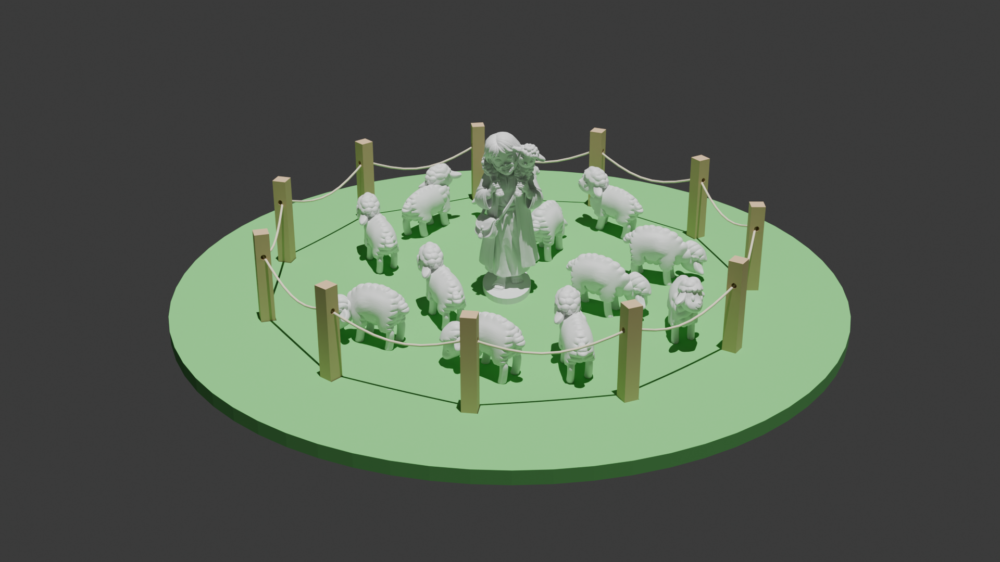

# Plateau Parabole du Bon Berger

## Impression 3 D
Imprimer =
- 1 berger
- 6 moutons A
- 6 moutons B

## Découpe Laser du plateau
Découper un plateau et 11 poteaux.
En bois de 5 mm d'épaisseur.

Plateau avec 11 poteaux : plateaux_avec_11poteaux.svg
ou plateau.svg
poteau.svg

Les poteaux sont troués pour faire passer une ficelle = la clôture.

> [!IMPORTANT]
Le projet en est à ses débuts. Les fichiers n'ont pas encore été tous testés.

Les retours d'utilisateurs sont attendus !

# Aperçu du matériel en bois artisanal

# Aperçu Blender du matériel 3D

